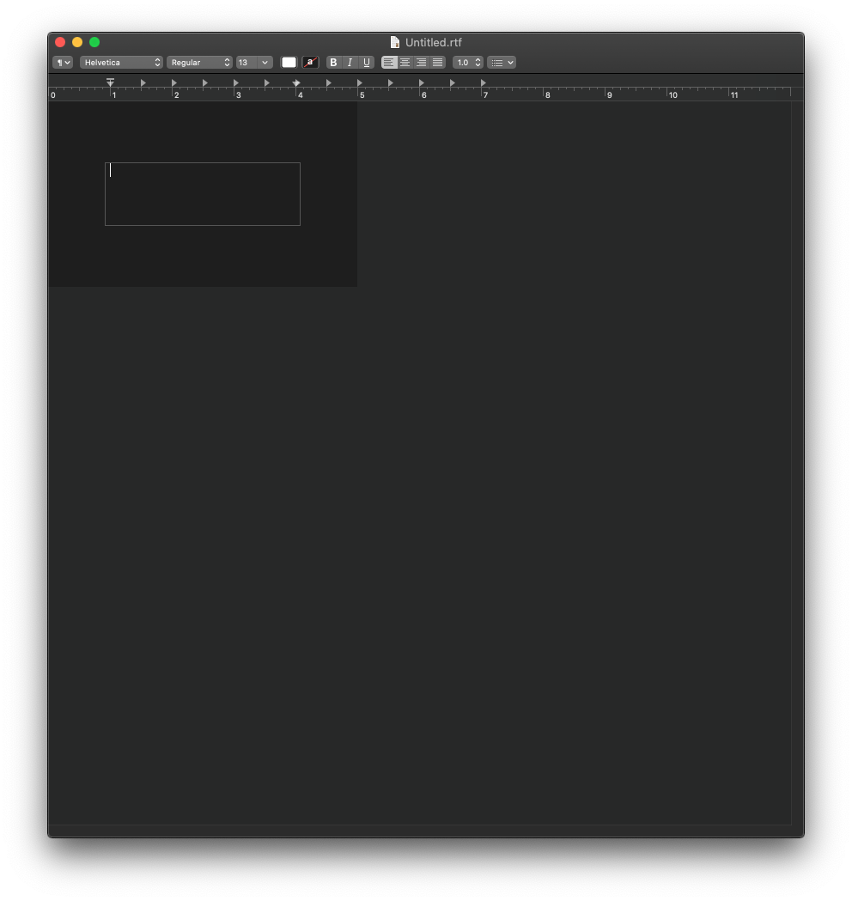
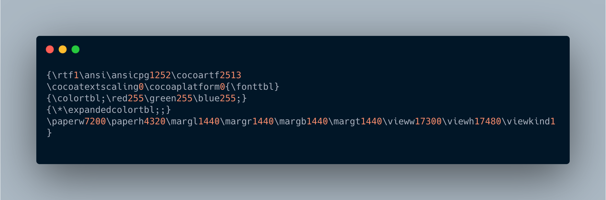
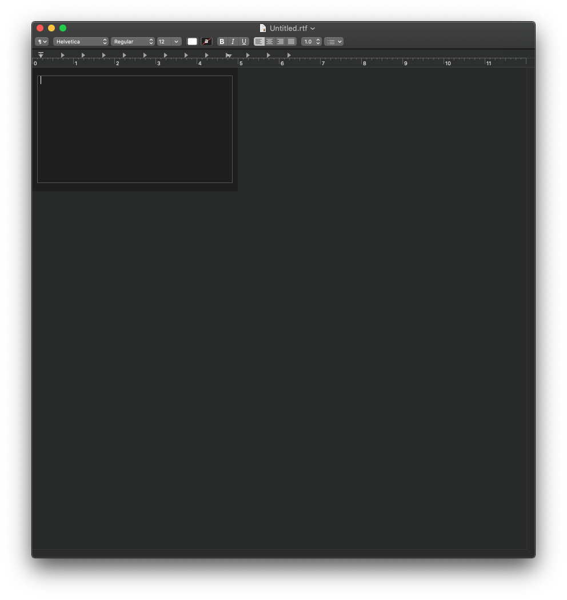

# Setting Page Margins in TextEdit

Today I wanted to print on some 3x5 cards. I set the page dimensions and margins in "Page Setup", but saw the margins were still extremely wide when looking at it using "Format > Wrap to Page":

After reading a few threads, people mentioned the best way to *actually* modify the margins was to edit the RTF file directly: https://forums.macrumors.com/threads/how-do-you-control-the-margins-in-textedit.101021/post-1175335

I modified the values of 1440 (~1") to 300 (.2") and got updated margins when I reopened the file!

